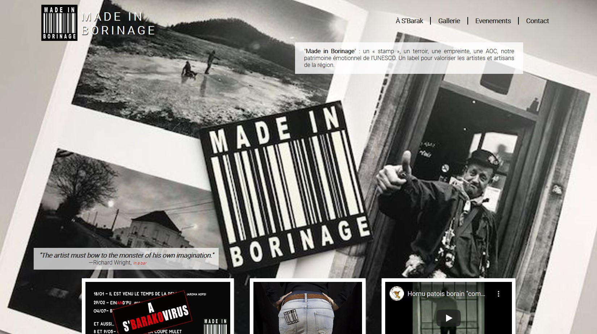

# One Page First Prototype

It is an exercice to handle the HTML basics and start using CSS.

*"Made In Borinage"* is an association which support artists around the region and creates events to display their works.

Link to GitHubPage : [Made In Borinage](https://jcbrognez.github.io/madeinborinage/)